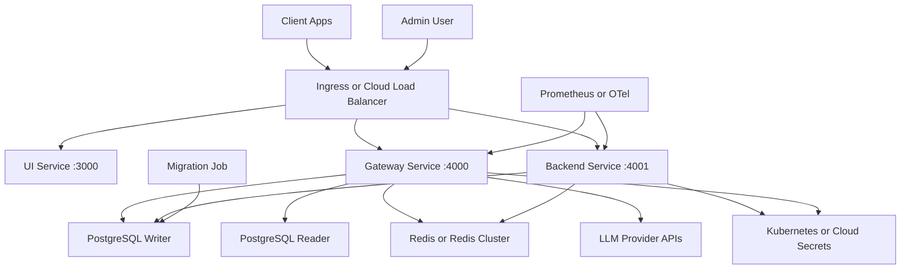
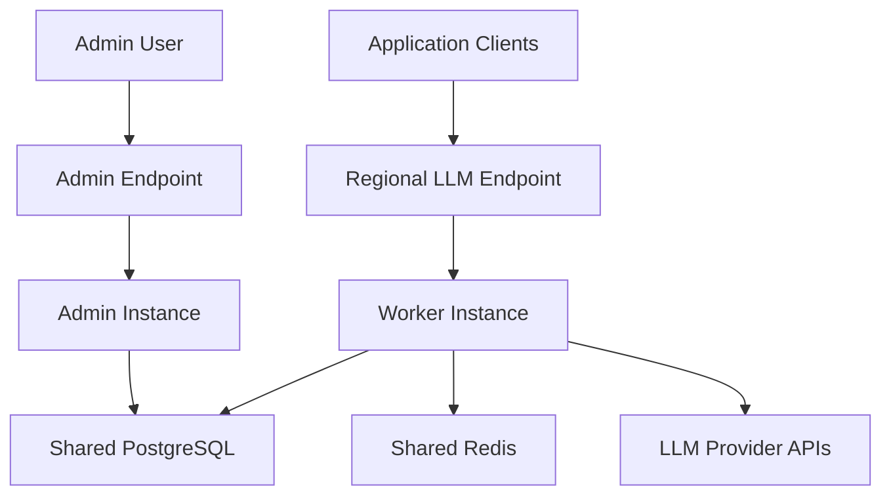
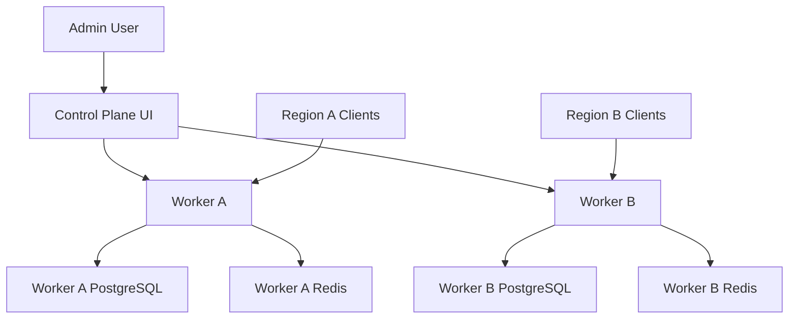

# LiteLLM clustered deployment

This runbook covers the commercial high availability deployment path for LiteLLM. It uses the componentized Helm chart in `TOKENHUB_PROXY_ROOT/helm/litellm`: gateway, backend, UI, and a migration Job. When `TOKENHUB_PROXY_ROOT` is not set, the scripts resolve the big-repo layout automatically

Use this path when LiteLLM needs multiple replicas, rolling upgrades, external HA data stores, separate scaling for LLM traffic and management APIs, or cloud load balancer routing

## Architecture



## Components

| Component | Port | Role |
| --- | --- | --- |
| Gateway | 4000 | LLM data plane for OpenAI-compatible, provider pass-through, health, and metrics endpoints |
| Backend | 4001 | Management API for keys, users, teams, models, budgets, and UI API calls |
| UI | 3000 | Static Admin UI |
| Migration Job | n/a | Runs migrations before gateway and backend pods serve a new release |

Ingress path routing is defined in `TOKENHUB_PROXY_ROOT/helm/litellm/templates/ingress.yaml`. LLM request paths route to gateway, UI assets route to UI, and management endpoints fall through to backend

This fork builds its own component images from source and does not pull the official `ghcr.io/berriai/litellm-*` images. The gateway, backend, and migration images all build from this source tree, so the deployed components reflect the current source rather than upstream. The UI image is a static dashboard and is built the same way for consistency

## Prerequisites

- Kubernetes cluster with Helm 3 (minikube works for local testing)
- Docker with BuildKit to build the component images
- External PostgreSQL writer, preferably with a reader endpoint for read routing
- Redis 7 or Redis Cluster for cache, rate-limit state, router state, and high traffic buffering
- TLS-capable ingress controller or cloud load balancer
- Kubernetes Secrets for master key, salt key, DB credentials, Redis password, and provider keys
- Outbound HTTPS from gateway pods to configured LLM providers

The chart currently exposes HPA settings but not PodDisruptionBudget values. Use node disruption controls in the cluster and add a PDB around the rendered Deployments if your platform requires one before voluntary maintenance

## Files

| File | Purpose |
| --- | --- |
| [build-images.sh](build-images.sh) | Build gateway, backend, migrations, UI, and fake provider images from source with a custom prefix/tag, optionally loading them into minikube |
| [values-ha-example.yaml](values-ha-example.yaml) | High availability values overlay for `TOKENHUB_PROXY_ROOT/helm/litellm`, pointing at locally built images |
| [values-minikube.yaml](values-minikube.yaml) | Local minikube values overlay using local Postgres, Redis, and fake provider |
| [minikube-dependencies.yaml](minikube-dependencies.yaml) | Local Postgres, Redis, and fake provider Deployments/Services for minikube |
| [install.sh](install.sh) | Build (optional), Secret, Helm install, and readiness wrapper |

## Image build

Build the component images from `tokenhub-proxy` (`TOKENHUB_PROXY_ROOT`) and the fake provider image from `tokenhub-e2e` (`TOKENHUB_E2E_ROOT`). `IMAGE_PREFIX` is prepended to each image name and `IMAGE_TAG` sets the tag. Leave `IMAGE_PREFIX` empty for plain local names (`litellm-gateway:local`, `litellm-backend:local`, `litellm-migrations:local`, `litellm-ui:local`, `litellm-fake-provider:local`):

```bash
IMAGE_PREFIX= IMAGE_TAG=local cluster/build-images.sh
```

Set a registry/namespace prefix to push to your own registry:

```bash
IMAGE_PREFIX=registry.example.internal/team IMAGE_TAG=local cluster/build-images.sh
```

For minikube, make the images visible to the cluster either by loading them after build:

```bash
LOAD_INTO_MINIKUBE=true cluster/build-images.sh
```

or by building directly inside minikube's Docker daemon:

```bash
eval $(minikube docker-env)
cluster/build-images.sh
```

The example values set `pullPolicy: IfNotPresent`, so locally present images are used without contacting a registry. Because these images are built locally, the upstream cosign verification flow does not apply; sign your own images if you need provenance

## Minikube local loop

Use this path to run the V1 local Kubernetes loop with fake provider, local Postgres, local Redis, gateway, backend, UI, and the migration Job. It is not a production topology; data is stored in ephemeral `emptyDir` volumes and is deleted with the namespace.

Start minikube:

```bash
minikube start --driver=docker
```

Build component images and load them into minikube. This builds gateway, backend, migrations, UI, and fake provider images:

```bash
IMAGE_PREFIX= IMAGE_TAG=local LOAD_INTO_MINIKUBE=true cluster/build-images.sh
```

Install the local dependencies and Helm release:

```bash
export LITELLM_MASTER_KEY="sk-local-master-key"
export LITELLM_SALT_KEY="sk-local-salt-key"
export DB_USERNAME="litellm"
export DB_PASSWORD="litellm-local-password"

NAMESPACE=litellm \
RELEASE=litellm \
VALUES_FILE=cluster/values-minikube.yaml \
IMAGE_TAG=local \
APPLY_MINIKUBE_DEPENDENCIES=true \
cluster/install.sh
```

Check the workload:

```bash
kubectl -n litellm get pods
```

Port-forward gateway and backend in separate terminals:

```bash
kubectl -n litellm port-forward svc/litellm-litellm-gateway 4000:4000
kubectl -n litellm port-forward svc/litellm-litellm-backend 4001:4001
```

Verify the V1 loop:

```bash
curl -sS http://localhost:4000/v1/models \
  -H "Authorization: Bearer ${LITELLM_MASTER_KEY}"

curl -sS http://localhost:4001/key/generate \
  -H "Authorization: Bearer ${LITELLM_MASTER_KEY}" \
  -H "Content-Type: application/json" \
  -d '{"models":["deepseek-chat"],"max_budget":10,"rpm_limit":60,"tpm_limit":100000}'

curl -sS http://localhost:4000/v1/chat/completions \
  -H "Authorization: Bearer <virtual-key>" \
  -H "Content-Type: application/json" \
  -d '{"model":"deepseek-chat","messages":[{"role":"user","content":"你好，简单介绍一下你自己"}]}'

curl -sS "http://localhost:4001/spend/logs?request_id=<chat-request-id>" \
  -H "Authorization: Bearer ${LITELLM_MASTER_KEY}"
```

Clean up:

```bash
helm -n litellm uninstall litellm
kubectl delete namespace litellm
```

## Required Secrets

The example values reference these Secret names:

| Secret | Keys |
| --- | --- |
| `litellm-master-key-secret` | `master-key` |
| `litellm-runtime-secret` | `salt-key`, optional `license` |
| `litellm-writer-secret` | `username`, `password` |
| `litellm-reader-secret` | `username`, `password` |
| `litellm-redis-secret` | `password` |
| `litellm-provider-secrets` | Provider keys such as `OPENAI_API_KEY`, `AZURE_API_KEY`, `AZURE_API_BASE` |

The install script can create or update these Secrets from environment variables. If your platform manages Secrets out of band, create them before running the script and leave the corresponding environment variables unset

## Deploy

Review and copy the values overlay:

```bash
cp cluster/values-ha-example.yaml /secure/litellm-values.yaml
```

Set the required values in your shell or a protected env file:

```bash
export NAMESPACE=litellm
export RELEASE=litellm
export VALUES_FILE=/secure/litellm-values.yaml
export IMAGE_PREFIX=          # empty for plain local names; or your registry/namespace
export IMAGE_TAG=local
export LITELLM_MASTER_KEY=sk-replace-with-a-random-admin-key
export LITELLM_SALT_KEY=sk-replace-with-a-random-salt-key
export DB_USERNAME=litellm
export DB_PASSWORD=replace-me
export REDIS_PASSWORD=replace-me
export OPENAI_API_KEY=replace-me
```

Run, optionally building the images in the same step:

```bash
BUILD_IMAGES=true LOAD_INTO_MINIKUBE=true cluster/install.sh
```

The script optionally builds the component images, creates the namespace if needed, upserts Secrets for values that are present in the environment, runs `helm upgrade --install` with the component image repositories/tags derived from `IMAGE_PREFIX` and `IMAGE_TAG`, waits for the migration hook, and waits for gateway, backend, and UI Deployments to roll out

The example values request HA-sized replicas and resources (3 gateway pods at 4Gi each, 2 backend pods). That is heavier than a default minikube. For local testing, edit your copied values file (`$VALUES_FILE`) before installing:

- set `gateway.hpa.minReplicas` and `backend.hpa.minReplicas` to `1`
- lower `gateway.resources.requests` and `backend.resources.requests` (for example `cpu: 250m`, `memory: 1Gi`)
- set `redis.cluster: false` and point `redis.host` at a single Redis if you are not running a cluster locally

## Verify

Port-forward the gateway service when ingress DNS is not ready:

```bash
kubectl -n litellm port-forward svc/litellm-litellm-gateway 4000:4000
```

Health checks:

```bash
curl -sS http://localhost:4000/health/liveliness
curl -sS http://localhost:4000/health/readiness
```

Provider smoke test:

```bash
curl -sS http://localhost:4000/v1/chat/completions \
  -H "Authorization: Bearer ${LITELLM_MASTER_KEY}" \
  -H "Content-Type: application/json" \
  -d '{
    "model": "gpt-4o",
    "messages": [{"role": "user", "content": "Say LiteLLM clustered deployment is ready"}]
  }'
```

## Production defaults

- Keep `gateway.numWorkers=1` and scale gateway horizontally
- Run at least three gateway replicas and at least two backend replicas
- Keep the migration Job enabled unless a separate release pipeline runs migrations before Helm
- Set `LITELLM_MODE=PRODUCTION` on gateway, backend, and migrations
- Set `LITELLM_SALT_KEY` before adding provider credentials through the UI
- Set `DISABLE_SCHEMA_UPDATE=true` on long-running app pods. The chart does this through its shared env helper
- Use Redis host, port, and password settings instead of `redis_url`
- Use `simple-shuffle` routing for high throughput unless a specific routing strategy is required
- Pin chart and image versions before production rollout

## Multi-region admin/worker options

Upstream gates these endpoint-toggle features behind a license; in this fork's build they are available from source. The architecture splits admin and worker responsibilities:



In the standard admin/worker model, the admin instance keeps UI and management APIs enabled and sets `DISABLE_LLM_API_ENDPOINTS=true`. Worker instances set `DISABLE_ADMIN_UI=true` and `DISABLE_ADMIN_ENDPOINTS=true`, while continuing to serve LLM APIs

For stronger blast-radius isolation, use the Enterprise high availability control plane pattern:



Each worker in that pattern has its own database, Redis, master key, users, teams, keys, and budgets. The control plane UI does not proxy LLM traffic

## Cloud reference stacks

The Terraform modules in `TOKENHUB_PROXY_ROOT/terraform/litellm` provide cloud-managed examples with the same component model:

- AWS: ECS Fargate, Aurora PostgreSQL writer/reader, ElastiCache, ALB, Secrets Manager
- GCP: Cloud Run, Cloud SQL writer/reader, Memorystore, external HTTPS load balancer, Secret Manager

Those stacks default to the official upstream images. To run this fork's source on them, build and push the component images to a registry the cloud can pull from and override the image inputs accordingly
