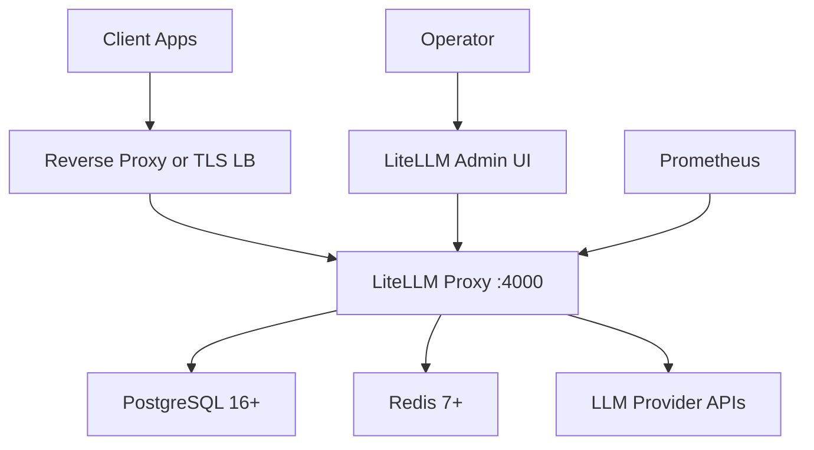

# LiteLLM private deployment

This runbook covers a single-site private LiteLLM deployment for a customer VPC, private subnet, or on-prem environment. It builds the LiteLLM Proxy image from `tokenhub-proxy` (`TOKENHUB_PROXY_ROOT`), runs it on port 4000 with an external PostgreSQL database, Redis for shared cache and routing state, and optional Prometheus scraping

This fork builds its own images and does not pull the official `ghcr.io/berriai/litellm-*` images. The deployed instance therefore reflects the current source tree, not upstream

For high availability across replicas or regions, use [../cluster/README.md](../cluster/README.md)

## Architecture



## When to use this path

Use this path when the customer needs a controlled self-hosted deployment and the operating model is still simple:

- One LiteLLM endpoint in one network boundary
- One Proxy container or a small number of manually managed containers
- External PostgreSQL with backups
- Redis available for cache, RPM/TPM state, and high traffic buffering
- TLS handled by an existing reverse proxy or load balancer

Do not treat this Compose file as a full HA platform. For commercial production, PostgreSQL and Redis should be managed or customer-operated with backups, monitoring, and restore procedures. The Redis service in [docker-compose.prod.yml](docker-compose.prod.yml) is an easy local starting point

## Files

| File | Purpose |
| --- | --- |
| [.env.example](.env.example) | Environment variable template. Copy it to `.env` and replace every placeholder before deployment |
| [config.example.yaml](config.example.yaml) | LiteLLM Proxy production config skeleton with database-backed model storage and Redis cache/router settings |
| [docker-compose.prod.yml](docker-compose.prod.yml) | Compose stack for LiteLLM Proxy (built from source), Redis, and optional Prometheus |
| [prometheus.yml](prometheus.yml) | Prometheus scrape config for `/metrics` |
| [install.sh](install.sh) | Build, migrate, start, and readiness wrapper |

## Image build

The proxy image is built from `tokenhub-proxy` using `TOKENHUB_PROXY_ROOT/docker/Dockerfile.database`. When `TOKENHUB_PROXY_ROOT` is not set, the Compose file and `install.sh` resolve the big-repo layout automatically

`LITELLM_IMAGE` is the full image reference and defaults to `litellm-database:local`. To tag it for your own registry, set a prefix in the reference, for example `registry.example.internal/litellm-database:local`, then push it with `docker push`

Because these images are built locally rather than pulled from the signed official registry, the upstream cosign verification flow does not apply. If you need provenance, sign your own images with your own key

## Prerequisites

- Docker Engine with Docker Compose v2 and BuildKit
- PostgreSQL 16 or later reachable from the LiteLLM host
- Redis 7 or later. The Compose example can run a local Redis service, but production should use a managed or HA Redis service when possible
- Outbound HTTPS access from LiteLLM to the configured LLM providers
- A TLS reverse proxy or load balancer in front of port 4000
- Provider API keys loaded through environment variables or a secret manager

## Configure

Copy the environment template and replace placeholders:

```bash
cp private/.env.example private/.env
```

Required values:

| Variable | Required | Notes |
| --- | --- | --- |
| `LITELLM_MASTER_KEY` | Yes | Must start with `sk-`. This is the admin key |
| `LITELLM_SALT_KEY` | Yes | Set once before storing credentials in the database |
| `DATABASE_URL` | Yes | PostgreSQL writer URL |
| `OPENAI_API_KEY`, `AZURE_API_KEY`, or another provider key | Yes | Match the providers used in `config.example.yaml` |
| `LITELLM_IMAGE` | No | Full image reference. Defaults to `litellm-database:local`. Add a registry/prefix here to push it |
| `DATABASE_URL_READ_REPLICA` | No | Optional read replica URL |
| `REDIS_HOST`, `REDIS_PORT`, `REDIS_PASSWORD` | Recommended | Use host, port, password fields rather than `redis_url` |

The default [config.example.yaml](config.example.yaml) exposes `gpt-4o` through OpenAI. Change `model_list` for the customer's provider mix. Use `os.environ/NAME` for secrets so provider keys stay out of the config file

## Deploy

Run the wrapper from the repository root:

```bash
private/install.sh
```

By default the script:

1. Loads `private/.env` when it exists
2. Validates required variables
3. Builds the proxy image from source with `docker/Dockerfile.database`
4. Runs LiteLLM migrations once with the built image and config
5. Starts the Compose stack
6. Waits for `http://localhost:4000/health/readiness`

Skip the build when the image already exists:

```bash
SKIP_BUILD=true private/install.sh
```

Or build and start manually with Compose:

```bash
docker compose --env-file private/.env \
  -f private/docker-compose.prod.yml up -d --build
```

Override paths and ports when needed:

```bash
ENV_FILE=/secure/litellm.env \
LITELLM_CONFIG_PATH=/secure/litellm-config.yaml \
LITELLM_PORT=4400 \
private/install.sh
```

Start Prometheus as well:

```bash
docker compose --env-file private/.env \
  -f private/docker-compose.prod.yml \
  --profile observability up -d
```

## Verify

Health checks:

```bash
curl -sS http://localhost:4000/health/liveliness
curl -sS http://localhost:4000/health/readiness
```

End-to-end provider call:

```bash
curl -sS http://localhost:4000/v1/chat/completions \
  -H "Authorization: Bearer ${LITELLM_MASTER_KEY}" \
  -H "Content-Type: application/json" \
  -d '{
    "model": "gpt-4o",
    "messages": [{"role": "user", "content": "Say LiteLLM private deployment is ready"}]
  }'
```

Admin UI:

```text
http://localhost:4000/ui
```

Use the master key as the initial admin credential, then create scoped virtual keys for applications

## Upgrade

1. Pull or merge the source changes you want to deploy
2. Back up PostgreSQL
3. Run `private/install.sh` to rebuild the image, apply migrations, and restart the service
4. Confirm `/health/readiness`
5. Run one real provider request through `/v1/chat/completions`

The Compose file sets `DISABLE_SCHEMA_UPDATE=true` on the long-running Proxy container. Keep migrations as a separate pre-start step so future multi-container deployments do not race the same schema

## Backup and restore

Back up PostgreSQL on the same schedule as other production control-plane databases. It contains virtual keys, teams, users, spend tracking, audit-related state, and model configuration when `store_model_in_db` is enabled

Store `LITELLM_SALT_KEY` with the same durability requirements as the database backup. If the salt key is lost or changed, encrypted provider credentials already stored in the database cannot be decrypted

## Security checklist

- Terminate TLS before traffic reaches port 4000
- Keep `.env` outside version control
- Use a dedicated database user with the minimum privileges required for the LiteLLM database
- Restrict egress to approved LLM providers when the customer network requires it
- Disable debug logging in production
- Use scoped virtual keys for applications instead of the master key
- Tag and pin your locally built image, and sign it with your own key if you need provenance
